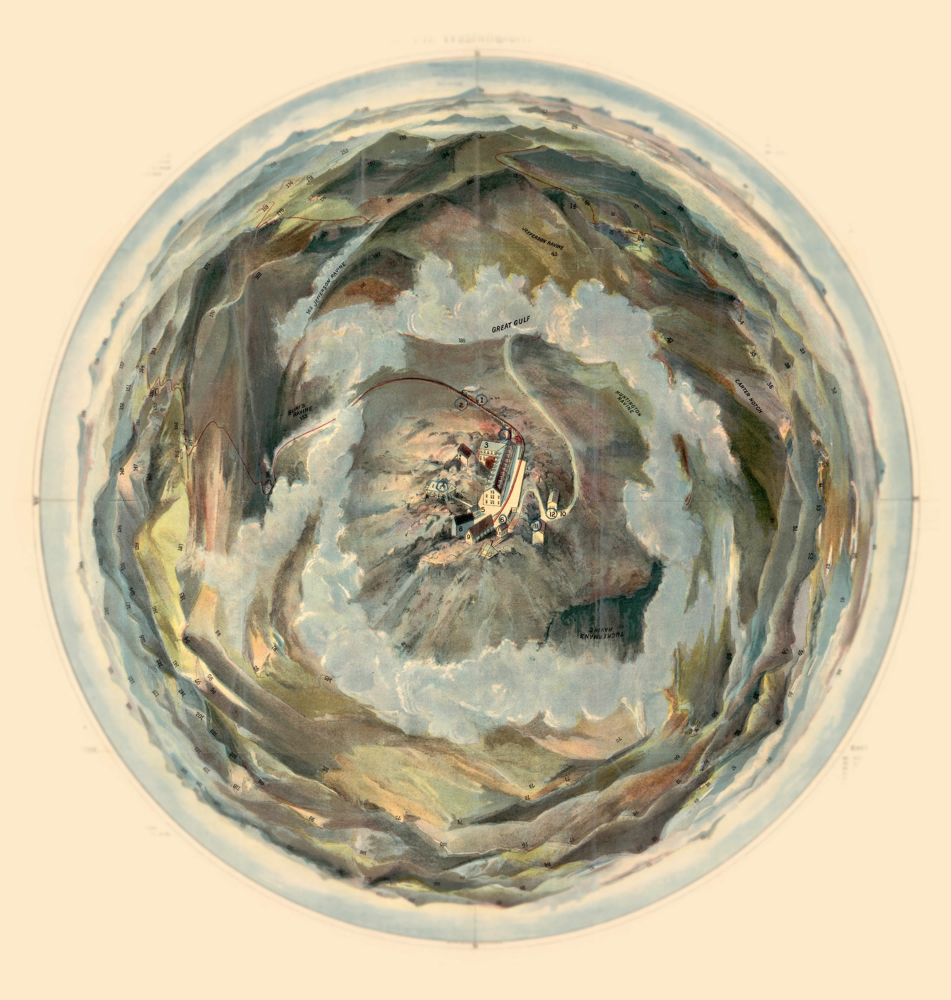

# Birds-eye view from summit of Mt. Washington, White Mountains, New-Hampshire

So why not rotate this Vintage Birds-eye view map from [Library of Congress](https://www.loc.gov/resource/g3742w.ct005518/?r=-0.313,0.045,1.584,0.974,0)? 

[view it live](https://vannizhang.github.io/birdeye-view/dist/)

